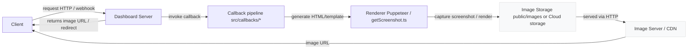

```markdown
TODO
should add a picture callback to display images/movies/gifs
switch to vitest
move pupperter to docker image

```

## Architecture

The diagram below shows how images are generated and delivered to clients.



Notes
- Code: callbacks live under `src/callbacks/` and templates under the callbacks' template files (e.g. `template.ejs`).
- Rendering: the renderer logic is in `src/utils/getScreenshot.ts` and related utilities (Puppeteer is used to render and capture screenshots).
- Storage/Serving: images are written to `public/images/` by default or uploaded to cloud storage (see `keys/` and any environment-specific config). Images are served over HTTP (optionally via a CDN).

This flow shows the happy-path: a client request triggers the server's callback pipeline, which renders HTML, captures an image, stores it, and then the client receives an image URL that can be fetched or embedded.
```markdown
