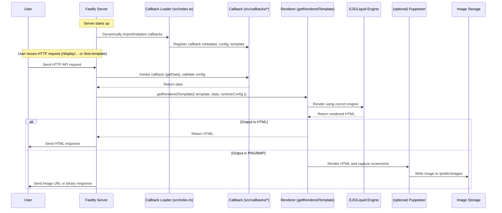

1. endpoint to register heart beat from device or register when the last request was made
1.should add a picture callback to display images/movies/gifs
2.switch to vitest
3. move pupperter to docker image
4. callback: load a notion page
5. callback: calendar

# Dashboard Server

A small Node/TypeScript server that renders HTML for a set of pluggable "callbacks", captures screenshots, and serves image or HTML responses for clients (useful for dashboards, inkplate displays, widgets, etc.).

Key ideas
- Callbacks live in `src/callbacks/*`. Each callback is responsible for fetching or producing data and exposing a template for rendering.
- Templates can be Liquid (`.liquid`) or EJS (`.ejs`). The renderer chooses a template per-callback and renders it with the provided data.
- The renderer uses Puppeteer to produce images (`src/utils/getScreenshot.ts`) and writes images to `public/images/` by default.
- Runtime configuration for callbacks is validated with Zod schemas exported from callback modules as `expectedConfig`.

## Quick start

Prerequisites
- Node 18+ (the project uses modern ESM/TS tooling).
- Chrome/Chromium is required by Puppeteer (the dependency is included in `package.json`).

Install and run in dev mode

```bash
npm install
npm run dev
```

> **Note:** If you encounter an error about missing `@rollup/rollup-linux-x64-gnu` or similar platform-specific packages, see [NPM_OPTIONAL_DEPS.md](./NPM_OPTIONAL_DEPS.md) for details and solutions. This is due to a known npm bug with optional dependencies.

This starts both the backend server and the admin interface concurrently:
- **Backend server** runs on `http://localhost:3333` (or your configured `PORT`) with hot-reload via `tsx --watch`
- **Admin interface** runs on `http://localhost:3001` with Vite dev server and HMR (Hot Module Replacement)

The admin dev server proxies API requests to the backend server, so you get a seamless development experience with instant feedback on both frontend and backend changes.

You can also run individual dev servers:
- `npm run dev:server` - Run only the backend server
- `npm run dev:admin` - Run only the admin interface

### Building for Production

The project includes an integrated build process that builds both the admin interface and the server:

```bash
npm run build
```

This single command:
1. Builds the admin interface (SolidJS app) to `public/admin/`
2. Compiles the TypeScript server code to `dist/`

You can also run individual build steps:
- `npm run build:admin` - Build only the admin interface
- `npm run build:server` - Build only the server

### Admin Interface

The server includes a web-based admin interface for monitoring connected clients in real-time.

**Development**: Access at `http://localhost:3001` (Vite dev server with HMR)
**Production**: Access at `http://localhost:3333/` (served by Fastify)

Features:
- **Real-time monitoring** of connected clients via Server-Sent Events (SSE)
- **TanStack Query** for efficient data fetching with caching
- **Client detail pages** - Click on any client to view:
  - Detailed callback configuration with options
  - Request history with status codes and response times
  - Activity logs with severity levels (info, warn, error)
  - Auto-refreshing data every 5 seconds
- **Password protection** (optional) - Set `ADMIN_PASSWORD` in `.env`
- **Connection status indicator**
- **Responsive UI** built with SolidJS and DaisyUI

#### Setting Up Password Protection

To enable password protection for the admin interface, add to your `.env` file:

```
ADMIN_PASSWORD=your-secure-password-here
```

Leave empty or omit to disable password protection (open access):

```
ADMIN_PASSWORD=
```

When enabled, users will be prompted to login before accessing the admin interface.

The admin interface is automatically served at the root path when you start the server.

## Environment
Create a `.env` file at the project root or export env vars. Example keys used by callbacks:

- `WEATHER_APIKEY` — API key for the weather callback (if enabled)
- `PORT` — server port

Other per-callback env variables are declared in each callback under `envVariablesNeeded`.

## Logging Configuration

The server uses [Pino](https://getpino.io/) for logging with support for remote log management via [Better Stack](https://betterstack.com/) (formerly Logtail).

### Local Logging

By default, logs are displayed in the console with pretty formatting via `pino-pretty`. You can control the log level using the `LOG_LEVEL` environment variable:

```bash
LOG_LEVEL=info npm run dev
```

Available log levels: `trace`, `debug`, `info`, `warn`, `error`, `fatal`

### Remote Logging with Better Stack

Better Stack provides a centralized logging platform with search, filtering, and retention capabilities. It's useful for production environments and debugging issues remotely.

**Setting up Better Stack:**

1. Sign up for a free account at [betterstack.com](https://betterstack.com/)
2. Navigate to the Logs section at [logs.betterstack.com](https://logs.betterstack.com/)
3. Create a new source and copy your source token
4. Add the token to your `.env` file:

```bash
LOGTAIL_SOURCE_TOKEN=your_source_token_here
```

5. Restart your server

**Free Tier:** Better Stack offers a generous free tier with 1GB of logs per month and 3-day retention, perfect for small projects and development.

When the `LOGTAIL_SOURCE_TOKEN` is configured, logs are sent to both:
- **Console** (with pino-pretty formatting) - for local development
- **Better Stack** - for remote viewing and persistence

You can view and search your logs in real-time through the Better Stack dashboard, which provides filtering, querying, and alerting capabilities.

## How it works (high level)

1. The server registers callbacks listed in `src/index.ts` (it dynamically imports `./callbacks/{name}/index.ts`).
2. Each callback module may export:
   - `expectedConfig` (a Zod schema) — used to validate runtime options.
   - A default template file `template.liquid` or `template.ejs` under the callback folder or a shared view under `views/`.
3. When rendering, the server calls the callback's `getData` method, then renders the callback's template using `getRenderedTemplate`, passing two top-level objects to the renderer:

```js
{ data, runtimeConfig }
```

For Liquid templates use `{{ data }}` and `{{ runtimeConfig }}` to access values.

4. If the requested view is an image type (`png`, `bmp`) the server captures a screenshot via Puppeteer; otherwise it returns the HTML.

## Architecture

The diagram below shows how images are generated and delivered to clients.



Notes
- Code: callbacks live under `src/callbacks/` and templates under the callbacks' template files (e.g. `template.ejs`).
- Rendering: the renderer logic is in `src/utils/getScreenshot.ts` and related utilities (Puppeteer is used to render and capture screenshots).
- Storage/Serving: images are written to `public/images/` by default or uploaded to cloud storage (see `keys/` and any environment-specific config). Images are served over HTTP (optionally via a CDN).

This flow shows the happy-path: a client request triggers the server's callback pipeline, which renders HTML, captures an image, stores it, and then the client receives an image URL that can be fetched or embedded.

## API Endpoints

### Client Management

- **POST /register/:clientName** — Register a new client with a callback playlist
  - Body: `{ playlist: [{ id, callbackName, options? }] }`
  - Returns client configuration

- **GET /display/:clientName/:viewType/:callback?** — Render and display a callback or layout
  - `:viewType` can be `png`, `bmp`, `html`, or `json`
  - Optional `:callback` parameter supports:
    - `next` - Advances rotation and renders next item (default)
    - Playlist item ID - Renders complete layout by ID (e.g., `my-first-layout`)
    - Callback ID - Renders individual callback (format: `playlistItemId-callbackName-index`)
  - See [ACCESSING_LAYOUTS_BY_ID.md](./ACCESSING_LAYOUTS_BY_ID.md) for layout access guide
  - See [TESTING_DUPLICATE_CALLBACKS.md](./TESTING_DUPLICATE_CALLBACKS.md) for callback examples

### Monitoring

- **GET /health** — Health check endpoint
  - Returns server status, available callbacks, and connected clients

- **GET /api/clients** — Get current state of all clients (JSON)
  - Returns full client data including playlists and callback configurations

- **GET /api/clients/stream** — Real-time SSE stream of client updates
  - Server-Sent Events endpoint for monitoring client changes
  - Sends updates when clients are registered or modified
  - Includes heartbeat every 30 seconds

### Template Testing

- **POST /test-template** — Test a template with custom data
  - Body: `{ templateType, template, templateData?, screenDetails }`
  - Useful for developing and debugging templates

## Templates

- Liquid and EJS are both supported. `getRenderedTemplate` chooses the correct engine based on the template file extension.
- When writing Liquid templates, prefer `{{ data.foo }}` and `{{ runtimeConfig.bar }}`. Use the `default` filter for ternary-like fallback: `{{ data.title | default: runtimeConfig.title }}`.

## Adding a new callback

1. Create `src/callbacks/<name>/index.ts` that extends `CallbackBase` (or matches the callback shape).
2. Optionally export `expectedConfig` (a Zod schema) and ensure you validate/merge runtime options.
3. Add a template at `src/callbacks/<name>/template.liquid` or `template.ejs` (or a shared view at `views/<name>.<ext>`).
4. Register the callback in `src/index.ts` so the server imports it at startup.

Minimal callback example (pseudo):

```ts
export const expectedConfig = z.object({ zipcode: z.string() });

class CallbackFoo extends CallbackBase<TemplateShape, typeof expectedConfig> {
  constructor(options = {}) {
    super({ name: 'foo', expectedConfig, receivedConfig: options });
  }

  async getData(config) { /* return template data */ }
}

export default CallbackFoo;
```

## Debugging templates

- If a template renders nothing, inspect the shape of the `data` passed to `getRenderedTemplate` — Liquid receives `{ data, runtimeConfig }`.
- Use console logs or temporarily render HTML to the console during development.

## Tests

Run unit tests with:

```bash
npm test
```

## Development notes & TODOs

- Callbacks and templates are intentionally lightweight — add more unit tests and a CI pipeline.
- Consider moving Puppeteer into a Docker image for reproducible rendering environments.
- Possible improvements: switch to Vitest, add end-to-end tests for rendering, add a configurable image storage backend.
